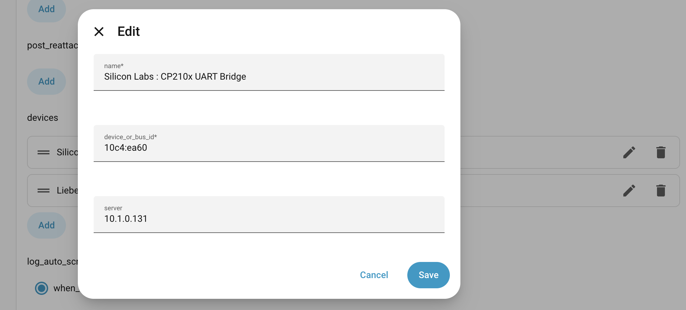

I have been slowly moving more of my services over to being properly highly available in my homelab and recently noticed I had been neglecting a core service, Home Assistant. I run [HAOS](https://developers.home-assistant.io/docs/operating-system) in a VM and while the VM itself is highly available and happy to migrate between my nodes, there is a human requirement to get everything fully back up and running. I have to scurry over and move the [Sonoff Zigbee USB dongle](https://sonoff.tech/en-us/products/sonoff-zigbee-3-0-usb-dongle-plus-zbdongle-p) from one Proxmox node to the other. An automatic failover results in me realizing it has happened when suddenly I can no longer control my lights and outlets. While I could go with a PoE based zigbee dongle, but that would mean purchasing new hardware. 

I figured there has got to be some way to proxy the usb connection over the network. This way I could just have the HAOS VM be connected continuously during live migrations between my Proxmox nodes. It turns out someone else solved that problem for me starting all the way back in 2005. Since kernel 3.17 [usb-ip](https://wiki.archlinux.org/title/USB/IP) has been in the kernel so using it is dead simple, I just need to know which usb devices I need to connect.

Running `lsusb` gives
```bash
Bus 002 Device 001: ID 1d6b:0003 Linux Foundation 3.0 root hub
Bus 001 Device 004: ID 10af:0001 Liebert Corp. PowerSure PSA UPS
Bus 001 Device 003: ID 10c4:ea60 Silicon Labs CP210x UART Bridge
Bus 001 Device 002: ID 2109:3431 VIA Labs, Inc. Hub
Bus 001 Device 001: ID 1d6b:0002 Linux Foundation 2.0 root hub
```

Now my goal is to proxy my UPS and the Sonoff dongle, I can easily tell that `10af:0001 Liebert Corp. PowerSure PSA UPS` is the UPS, but I'm not positive that `10c4:ea60 Silicon Labs CP210x UART Bridge` is the Sonoff dongle. Putting a `-v` verbose flag on the command dumps the full output which then makes it super obvious that my guess was correct. 

```bash
Bus 001 Device 003: ID 10c4:ea60 Silicon Labs CP210x UART Bridge
  ...
  idVendor           0x10c4 Silicon Labs
  idProduct          0xea60 CP210x UART Bridge
  bcdDevice            1.00
  iManufacturer           1 Itead
  iProduct                2 Sonoff Zigbee 3.0 USB Dongle Plus V2
  iSerial                 3 80bcfdbfd48bee118710fc018acbdcd8
  ...
```

It was at this point that I began testing and binding devices but quickly ran into an issue with the bus ids  changing on reboot. Using a command like `usbip attach -r server_IP_address -b 1-1.4` would only work for the current boot. Since ids were changing I would need to do some sort of lookup in order to persist this across boots. Thankfully that problem has also already been solved by using vendor/device id instead of the bus id. An example sits right under [Section 3.1](https://wiki.archlinux.org/title/USB/IP) on the USB/IP Arch wiki article.

First I needed a service to kickstart the usbip daemon

```systemd
[Unit]
Description=USB/IP daemon
After=network.target

[Service]
Type=forking
ExecStart=/usr/sbin/usbipd -D

[Install]
WantedBy=multi-user.target
```

And then I used the section 3.1 example provided by the Arch wiki. I did need to adjust the paths for this one though since Debian uses `/usr/sbin` for these binaries instead of `/usr/bin`.

```systemd
[Unit]
Description=USB-IP Binding device id %I
After=network-online.target usbipd.service
Wants=network-online.target
Requires=usbipd.service

[Service]
Type=simple
ExecStart=/bin/sh -c "/usr/sbin/usbip bind --$(/usr/sbin/usbip list -p -l | grep '#usbid=%i#' | cut '-d#' -f1)"
RemainAfterExit=yes
ExecStop=/bin/sh -c "/usr/sbin/usbip unbind --$(/usr/sbin/usbip list -p -l | grep '#usbid=%i#' | cut '-d#' -f1)"
Restart=on-failure

[Install]
WantedBy=multi-user.target
```

Now, all I need to do is just enable everything
```bash
systemctl enable usbipd
systemctl enable usbip-bind@10c4:ea60.service
systemctl enable usbip-bind@10af:0001.service
```

And then go over to Home Assistant to turn on my usbip client. I have had rock solid performance from https://github.com/cryptedx/ha-usbip-client and the configuration is super simple in the gui. For use with any other VM I would probably go the route of a systemd service on the client, but HAOS doesn't expose systemd configuration and is very limited in terms of control so the app is the simplest way. 

In the `HA USB/IP Client` app all you need to do is configure the ip address of the device that is hosting the usbip devices, let it connect, bind to the device ids, and then you're done. They will now connect automatically when HAOS starts up.



Now you can use the devices like they were natively passed through to the HAOS VM. I can now migrate HAOS between the nodes when rebooting during maintenance and not lose my Zigbee devices.
